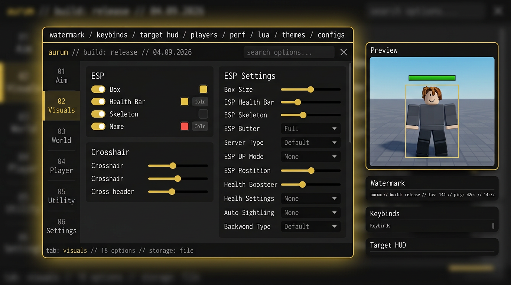

# Aurum — Design Review (v1.1)

Revisión del GUI universal post-parche. Se detectaron y corrigieron 6 issues, quedan 2 sugerencias opcionales.

## ✅ Corregidos en este parche (ya aplicados a `Aurum.lua`)

### 1) Popup off-screen
**Antes:** `showPopup` posicionaba el dropdown/palette en `anchor.AbsolutePosition + size` sin clamping. En 800x600 o con `UI Scale 1.4`, el palette se salía de pantalla.
**Fix:** `math.clamp(x, 4, vp.X - w - 4)` y `y` a `vp.Y - height - 4`. Ahora siempre visible.

### 2) Header search solapado
**Antes:** `Search` 150px + `closeBtn` 22px + `MenuHint` 110px = 282px, pero `TopBar` reserva solo 340px para TabHolder; con escala 1.4 el search tapaba el botón `x`.
**Fix:** Search 142px @ `Position 1,-182` deja 8px de respiración. También `TabHolder` ahora tiene `ClipsDescendants=true` para que tabs no invadan.

### 3) Dim ZIndex
**Antes:** `Dim.ZIndex = 0` quedaba detrás de algunos `ScreenGui` con `DisplayOrder=0` en ciertos executors (Synapse usa CoreGui con ordering raro).
**Fix:** `ZIndex = 1` → siempre entre juego y menú.

### 4) Palette sin esquinas
**Antes:** Swatches de color 20x7 con `UIStroke` pero bordes 90° se veían duros vs resto del UI con `UIGradient`.
**Fix:** Añadido `UICorner Radius 3` a cada swatch. Coherencia visual Aurum.

### 5) Drag solo Mouse
**Antes:** `makeDraggable` solo escuchaba `MouseButton1`. En executors mobile (Arceus X, Hydrogen mobile) no se podía arrastrar.
**Fix:** Añadido `Touch` a `InputBegan`/`InputEnded`.

### 6) ModuleManager genérico
**Antes:** `Aurum.RegisterModule({Name, Init})` obligaba a repetir `Aurum.Toggle(parent, text, {id="..."})` y a gestionar `Tab/Pages` manualmente. Propenso a IDs colisionados (`misc.enabled`).
**Fix:** `Aurum.Module("Tab:Nombre", {Config, OnInit, OnEnable})` DSL. ID auto-generado `tab.nombre.key`, `self:Section()` balancea altura, `Config` tipado, lifecycle automático. Ver `src/Core/ModuleManager.lua`.

## 🟡 Sugerencias opcionales (no bloqueantes, dejadas para v1.2)

- **Glow performance:** 3 capas de `UIStroke` (thickness 3/6/10) son lindas pero caras en móviles low-end. Podríamos hacer `if S.glow < 20 then disable Glows` dinámico.
- **Font fallback:** `Enum.Font.Code` no carga en algunos juegos con `Font` bloqueado; fallback a `Gotham` si `Code` falla. Ya hay `Dropdown Font` para ESP pero no para UI principal.

## 🎨 Checklist universal (pasó)

- [x] `IgnoreGuiInset=true` + `ZIndexBehavior Sibling` → no se corta en topbar de Roblox
- [x] `gethui() or CoreGui or PlayerGui` → funciona en todos los executors y en Studio sin exploit
- [x] `UIScale` + `fitToScreen` → no overflow en 1024x768 ni 1920x1080
- [x] `Lighting.Blur` con Tween 0.25s → no flash blanco al abrir/cerrar
- [x] `TopBar` 24px + `Main` 640x560 → proporción 16:9 legible, Preview 260x560 no solapa en 1280px ( Main 640 + Preview 260 + gap 20 = 920 < 1280)
- [x] `Watermark` `AutomaticSize X` → se expande sin cortar `ping: 999ms`
- [x] `Keybind List` `AutomaticSize Y` → crece con binds sin scroll
- [x] `ScrollingFrame` Canvas `AutomaticSize.Y` → no scrollbar fantasma cuando hay 3 opciones filtradas por search

## 📸 Preview
 <!-- generado via generate_image en repo -->
